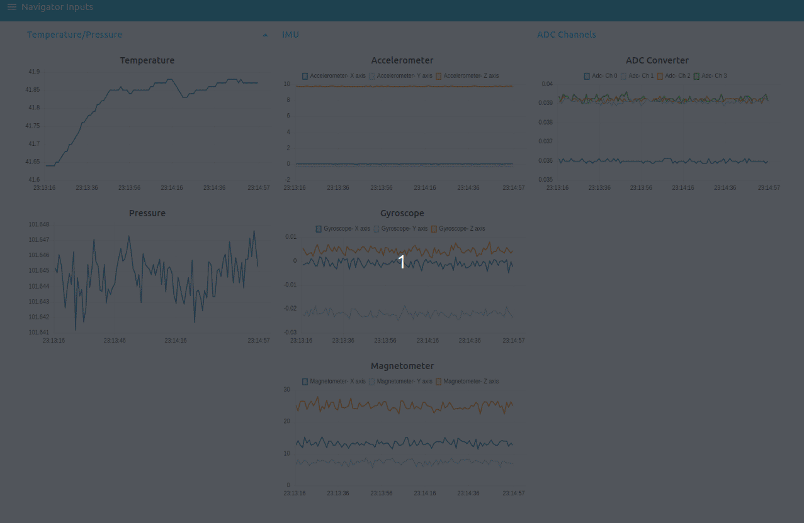
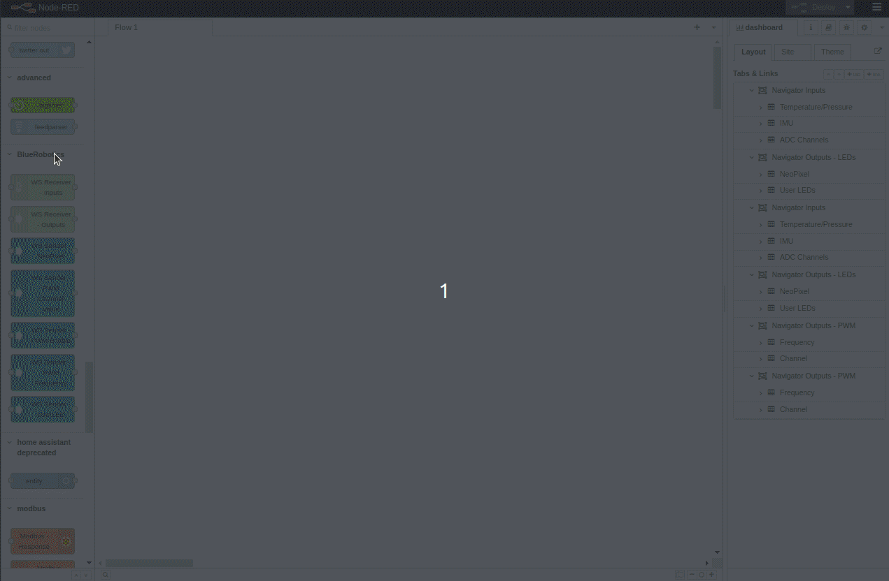

node-red-contrib-br_navigator-webassistant
=====================

Node-RED nodes for BlueRobotics's navigator

## Install

Run the following command in your Node-RED user directory - typically `~/.node-red`

        npm install node-red-contrib-br_navigator-webassistant

Example
-------
You can create a dashboard and plot sensors data or control navigator hardware.

How install the dashboard example.

